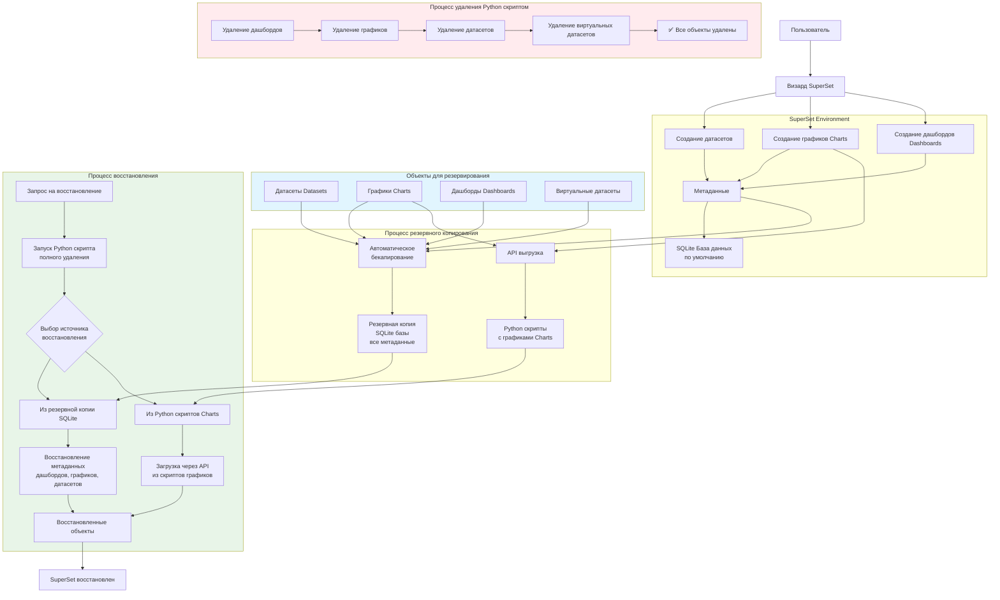

# Схема работы

```mermaid

flowchart TD
A[Пользователь] --> B[Визард SuperSet]
B --> C[Создание датасетов]
B --> D[Создание графиков Charts]
B --> E[Создание дашбордов Dashboards]

    subgraph SuperSet [SuperSet Environment]
        C --> F[Метаданные]
        D --> F
        E --> F
        F --> G[SQLite База данных<br/>по умолчанию]
    end

    subgraph Backup [Процесс резервного копирования]
        H[Автоматическое<br/>бекапирование] --> I[Резервная копия<br/>SQLite базы<br/>все метаданные]
        J[API выгрузка] --> K[Python скрипты<br/>с графиками Charts]
    end

    F --> H
    D --> J

    subgraph ObjectsToBackup [Объекты для резервирования]
        L[Датасеты Datasets]
        M[Графики Charts]
        N[Дашборды Dashboards]
        O[Виртуальные датасеты]
    end

    L --> H
    M --> H
    N --> H
    O --> H
    M --> J

    subgraph DeleteProcess [Процесс удаления Python скриптом]
        P[Удаление дашбордов] --> Q[Удаление графиков]
        Q --> R[Удаление датасетов]
        R --> S[Удаление виртуальных датасетов]
        S --> T[✅ Все объекты удалены]
    end

    subgraph Restore [Процесс восстановления]
        U[Запрос на восстановление] --> V[Запуск Python скрипта<br/>полного удаления]
        V --> W{Выбор источника<br/>восстановления}
        W --> X[Из резервной копии SQLite]
        W --> Y[Из Python скриптов Charts]
        X --> Z[Восстановление метаданных<br/>дашбордов, графиков, датасетов]
        Y --> AA[Загрузка через API<br/>из скриптов графиков]
        Z --> AB[Восстановленные объекты]
        AA --> AB
    end

    I --> X
    K --> Y
    AB --> AC[SuperSet восстановлен]

    style ObjectsToBackup fill:#e1f5fe
    style DeleteProcess fill:#ffebee
    style Restore fill:#e8f5e8
```
