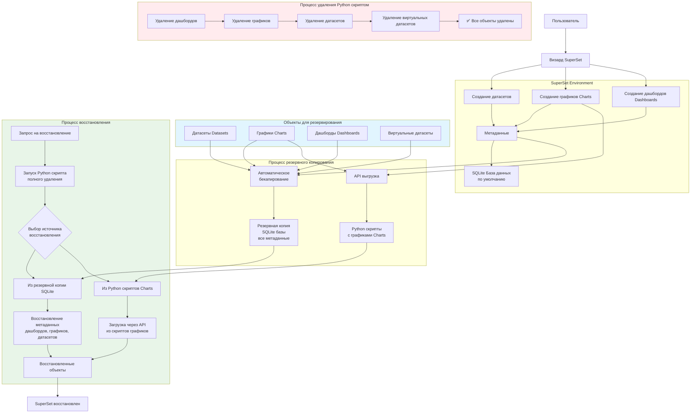

## Docker

PG запускается с базой данных Chinook [Chinook Database](https://github.com/lerocha/chinook-database).


```bash
docker-compose up -d # запуск контейнеров SuperSet + PG
```

## auto_super

```bash
pyshon ./delete_superset.py # удалить все метаданные
```

```bash
pyshon ./datasets_create.py # создать датасеты
```

## superset_db

1.  stop_superset.bat - копирует метаданные SuperSet
2.  restore_superset.bat - восстанавливает метаданные SuperSet

## superset_restore

### import_superset_artifacts.py

1. ✅ Авторизуется в Superset
2. ✅ Импортирует подключение к БД
3. ✅ мпортирует датасеты
4. ✅ мпортирует графики
5. ✅мпортирует дашборд

### export_superset_artifacts.py

1. ✅ Авторизуется в Superset
2. ✅ Экспортирует подключение к БД
3. ✅ Экспортирует все датасеты
4. ✅ Экспортирует все графики
5. ✅ Экспортирует весь дашборд

## Схема работы


